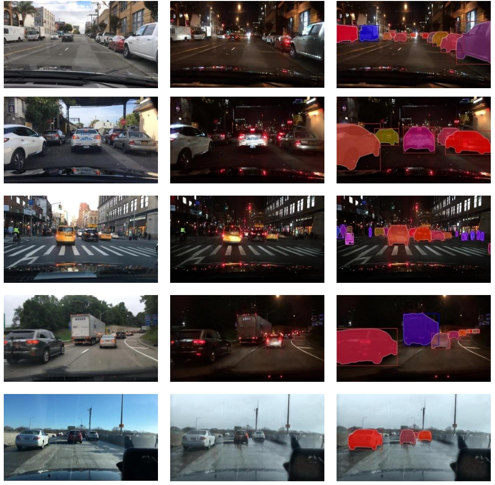
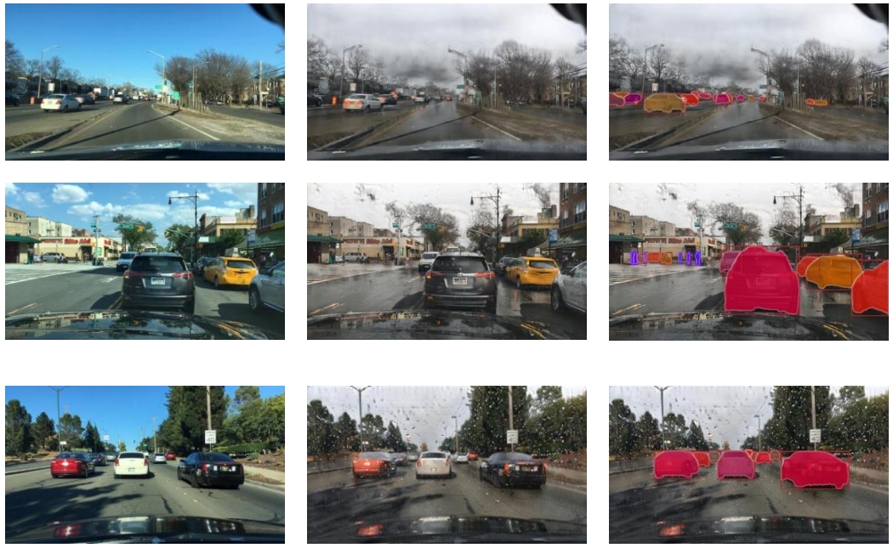
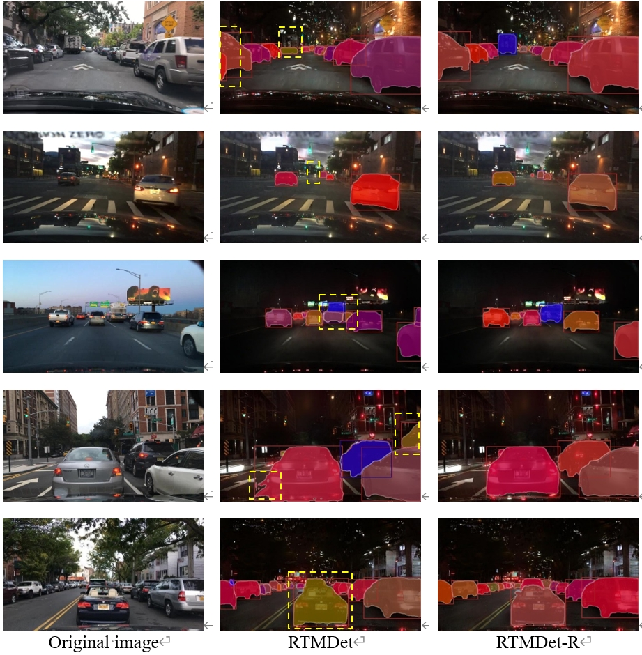
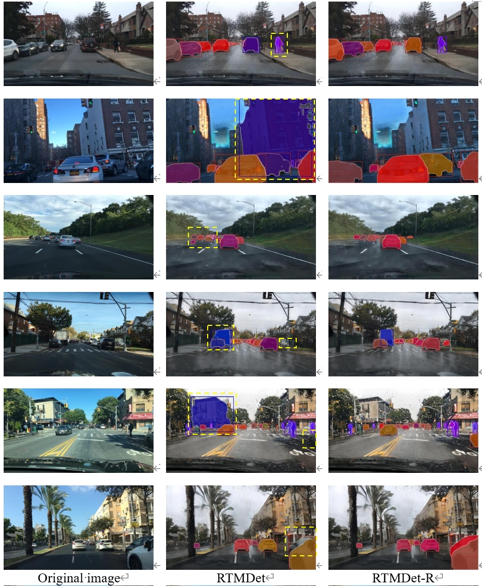

<h1 align="center">RTMDet-R: A robust instance segmentation network for complex traffic scenarios</h1>
This is an official implementations for "RTMDet-R: A robust instance segmentation network for complex traffic scenarios"

The main architecture of RTMDet-R is based on [RTMDet](https://arxiv.org/pdf/2212.07784.pdf)
The code is based on [mmdetection](https://github.com/open-mmlab/mmdetection)
# Update
(4/14: Upload the code and pretrained model.)
# Image results
<p align="center">
   
   
</p>

## Results comparision
<p align="center">
   
   
</p>

# Installation
Install the dependencies and prepare the datasets according to the guidelines in [mmdetection](https://mmdetection.readthedocs.io/en/latest/get_started.html)
```
conda create -n rtmdetr python=3.8
conda activate rtmdetr
conda install pytorch torchvision -c pytorch
pip install -U openmim
mim install mmengine
mim install "mmcv>=2.0.0"
git clone https://github.com/open-mmlab/mmdetection.git
cd mmdetection
pip install -v -e .
```
Download our code using
```
git clone https://github.com/GTrui6/RTMDet-R.git
```
The BDD-C dataset is too large to upload. We here provide some of the data for visualize, which processed by [TPSeNCE](https://github.com/ShenZheng2000/TPSeNCE). We appreciate for their [work](https://github.com/ShenZheng2000/TPSeNCE) in image generation, which helps us build the BDD-C dataset. The samples of [BDD-C](https://drive.google.com/file/d/1n3LyjER2r2hUxTxBA5XJcMyttJWBOSZQ/view?usp=sharing) is here. 

# Visualization
You can require the weights of model [here](https://drive.google.com/file/d/1KU7yPHORFmMUwivpSFiA85_jvPoQ2OTZ/view?usp=sharing)
and do the model inference and visualization with 
```
python demo/image_demo.py "path to your data image" \
        /configs/rtmdet-t/rtmdet-r_s.py "path to config file" \
        --palette voc \
        --weights "path to weights" \
        --out-dir "path to output"
```
# Training
You can train your own dataset with the coco-style with
```
python tools/train.py    /configs/rtmdet-r/rtmdet-r_s.py \
```
# Contact
For technical problem, please create an issue.

If you have any private question, please feel free to contact me via 2212204055@stmail.ujs.edu.cn
